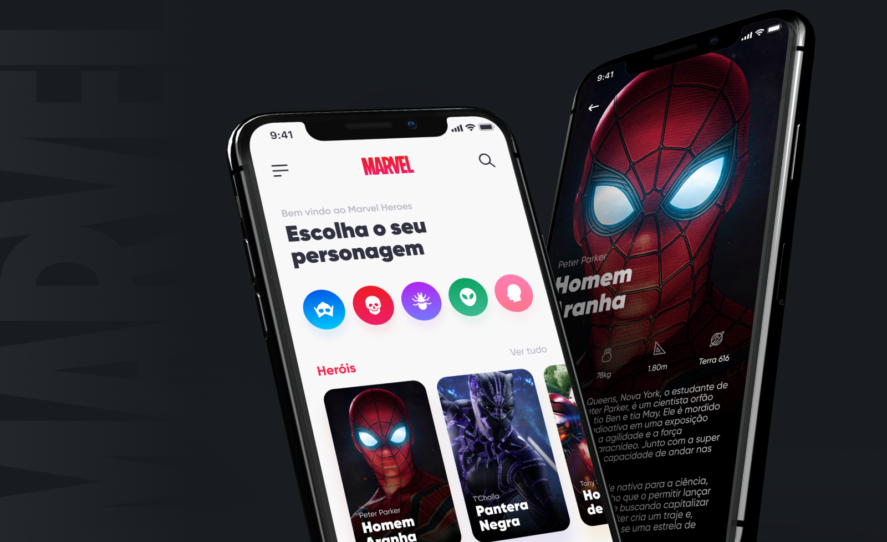

<h1 align="center">
<br>
  
<br>
<br>
Marvel Heroes App
</h1>

<p align="center">Aplicativo simples que lista personagens da Marvel e suas informações como biografia, níveis de habilidade e participações em filmes.</p>

<div>
  
</div>

# 📋 Índice

- [Telas](#-Telas)
- [Sobre o projeto](#-Sobre-o-projeto)
- [Tecnologias utilizadas](#-Tecnologias-utilizadas)
- [Rodando o projeto](#-Rodando-o-projeto)
  - [Pré-requisitos](#-Pré-requisitos)
  - [Rodando o server](#-Rodando-o-server)
  - [Rodando o aplicativo mobile](#-Rodando-o-aplicativo-mobile)

## 🎨 Telas


## 📃 Sobre o projeto

Aplicativo proposto como desafio pela <a href="https://umpontoseis.com/" target="_blank">umpontoseis</a> no site de desafios <a href="https://devchallenge.now.sh" target="_blank">DevChallenge</a> onde objetivo é desenvolver um app que liste alguns personagens da Marvel e suas caracteristicas, tudo isso seguindo o design proposto proposto e utilizando os dados fornecidos.

## 🛠 Tecnologias utilizadas

- ⚛️ **React native** — Aplicativo mobile
- 📱 **React native linear gradient** — Efeito de gradient nas imagens

## 🚀 Rodando o projeto

A aplicação é dividida em duas partes, mobile e server, o aplicativo mobile precisa que o server esteja sendo executado para funcionar.

### Pré-requisitos

- Git
- NodeJS
- Setup React Native CLI

### 💻 Rodando o server

Clone o repositório

```bash

# Clona o repositório
git clone https://github.com/thiagosprestes/Marvel-heroes-app.git

```

Navegue até a pasta do projeto clonado e execute os comandos abaixo

```bash

# Entra na pasta do server
cd server


# Troque a linha SEU_ENDEREÇO_DE_IP pelo endereço de IP do seu computador

# Inicia o server
npx json-server application.json --host SEU_ENDEREÇO_DE_IP -p 3333

# Acesse http://localhost:3333 para acessar o servidor caso deseje

```

### 📱 Rodando o aplicativo mobile

Caso já tenha clonado o repositório basta pular a primeira etapa

```bash

# Clona o repositório
git clone https://github.com/thiagosprestes/Marvel-heroes-app.git

```

Navegue até a pasta do projeto clonado e execute os comandos abaixo

```bash

# Entra na pasta do aplicativo
cd mobile

# Instala as dependências
npm install

```
Após concluir a instalação das dependências, dentro da pasta mobile renomeie o arquivo chamado ```.env-example``` para ```.env```, após isso abra o arquivo e troque o endereço ```http://0.0.0.0./3333/``` pelo endereço de IP do seu computador, o mesmo utilizado para executar o server.

Após isso, no terminal da pasta mobile execute o comando abaixo

```bash

# Inicia o aplicativo no Android
yarn android

# Inicia o aplicativo no iOS
yarn ios

```
